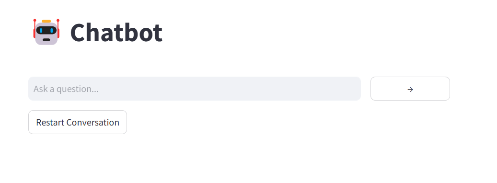
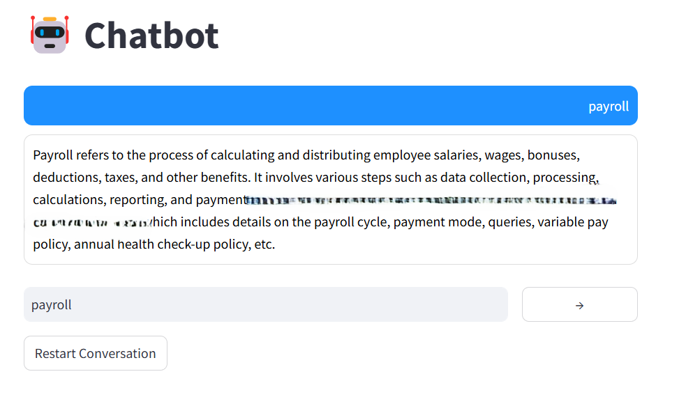

# HR Policy Chatbot

## 📌 Overview

The **HR Policy Chatbot** is a smart AI-powered chatbot designed to answer HR-related queries by reading and understanding policy documents. It leverages **Mistral 7B**, a powerful open-source language model, to provide accurate and context-aware responses.

## 🛠️ Features

- 📂 Upload your HR policy PDFs
- 🔍 Search and retrieve relevant HR policies
- 🤖 Uses **Mistral 7B** for intelligent responses
- 🌐 Accessible via a simple **web interface (Flask + Streamlit)**

---

## 🚀 Getting Started

### 1️⃣ Clone the Repository

```sh
git clone https://github.com/yourusername/hr-policy-chatbot.git
cd hr-policy-chatbot
```

### 2️⃣ Install Dependencies

Ensure you have Python **3.9+** installed, then run:

```sh
pip install -r requirements.txt
```

### 3️⃣ Download the Mistral 7B Model

This chatbot uses the **Mistral 7B** model. Download it from Hugging Face:

```sh
pip install huggingface_hub
python -c "from huggingface_hub import snapshot_download; snapshot_download(repo_id='mistralai/Mistral-7B', local_dir='models/')"
```

This will store the model in the **models/** directory inside your project.

### 4️⃣ Upload HR Policy PDFs

Place your HR policy documents inside the **`pdf_files/pdfs/`** folder:

```plaintext
chatbot/
│── pdf_files/           # Folder to store HR policy PDFs
│   ├── pdfs/            # Upload PDFs here
│── models/              # Folder to store the Mistral 7B model
│── screenshots/         # Folder to store UI screenshots
│   ├── chatbot_ui_1.png
│   ├── chatbot_ui_2.png
│── chatbot.py
│── app.py
│── requirements.txt
```

### 5️⃣ Run the Chatbot

Start the chatbot by running:

```sh
python app.py
```

This will launch the chatbot UI in your web browser.

---

## 💡 Usage Instructions

1. **Upload HR policy PDFs** into the `pdf_files/pdfs/` folder.
2. **Start the chatbot** using `python app.py`.
3. **Ask your HR policy-related queries**, and the chatbot will fetch relevant answers from the documents.

---

## 📸 Screenshots

Here are some previews of the chatbot UI:

### Chatbot Interface


### Response Example


---

## 🔧 Troubleshooting

If you encounter issues:

- Ensure all dependencies are installed correctly (`pip install -r requirements.txt`)
- Check that the **Mistral 7B model** is downloaded in the `models/` directory
- Run `python app.py` from the project directory

---

## 🤝 Contributing

Feel free to **fork this repository** and improve the chatbot! PRs are welcome. 😊

---

## 🐜 License

This project is licensed under the MIT License. See `LICENSE` for details.


